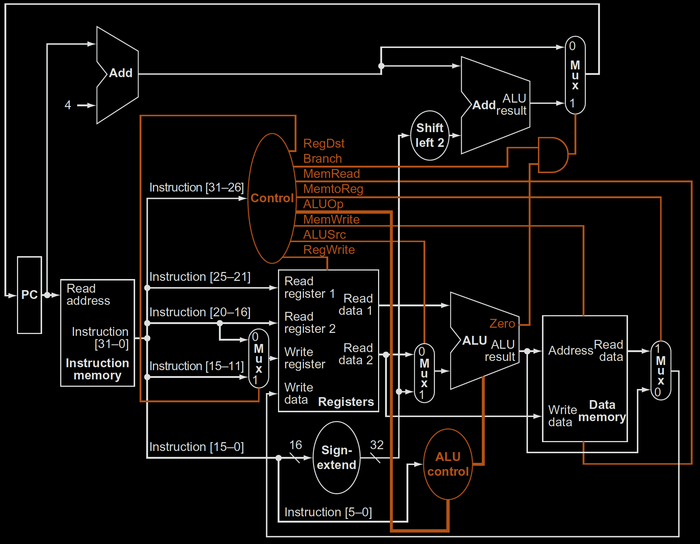
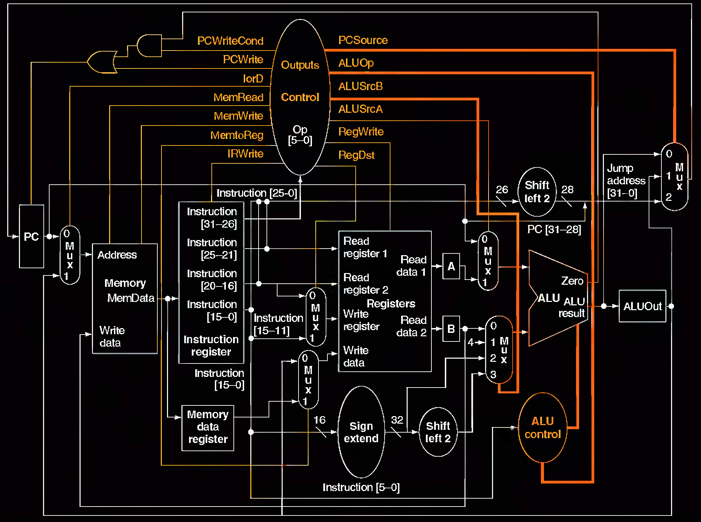
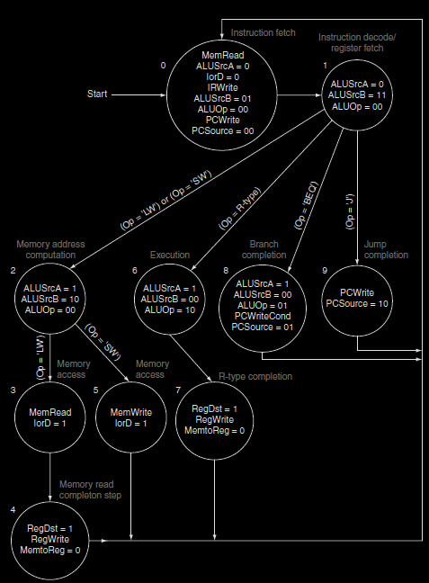

# MIPS Single-Cycle Multi-Cycle Implementation
> Single-Cycle and Multi-Cycle implementation of a subset of MIPS instruction set. 

An impplementation of 16-bit MIPS ISA, written in Verilog 2005 (IEEE Standard 1364-2005). 

## Table of Contents
- [Instructions](#Instructions)
- [How It Works](#How-It-Works)
- [See Also](#see-also)

## Instructions

**R-Type**

| 15 .. 12 | 11 .. 9 | 6 .. 8 | 5 .. 3 | 2 .. 0 |
| ---- | ---- | ---- | ---- | ---- | 
| opcode | source 1 | source 2 | destination | function |

Instructions include: add, sub, and, or, xor, nor, slt

**I-Type**

| 15 .. 12 | 11 .. 9 | 6 .. 8 | 5 .. 0 |
| ---- | ---- | ---- | ---- |
| opcode | register 1 | register 2 | immediate |

Instructions include: addi, andi, ori, subi, lhw, shw, beq, bne, blt, bgt

**J-Type**

| 15 .. 12 | 11 .. 0 |
| ---- | ---- |
| opcode | jump address |

Instructions include: jmp

## How It Works

Each module is located in its own file.

The single-cycle implementation closely but not entirely follows the below data path from the book Computer Organization, Design, and Architecture:

The multi-cycle implementation closely but not entirely follows the below data path:

The finite state machine for the control unit of the multi-cycle implementation is something like this:

## See Also

[MIPS ISA](https://en.wikipedia.org/wiki/MIPS_architecture)
